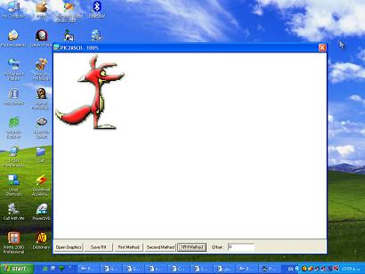



## Picture To Text

### Description

This program can translate bmp,jpg,ico,gif images to their equivalent text pattern, this program is written in vb 6 and it uses three methods for translating , first two methods are slow, but the third one (XRtf method) is very fast, it creates TextRtf then assigns it to RichTextBox's TextRtf property.Creating TextRtf is very fast but assigning it to RichTextBox's TextRtf property is slow! This program is useful for sending small images to softwares which do not support images. more image is bigger more time is needed. if you have enough time you can translate larger images. Please provide us with your feedbacks.Thank you in advance for your information &amp; feedbacks .

Arya Software Group
 
### More Info
 

             |
---                |---
**Submitted On**   |2002-03-09 16:20:14
**By**             |[Arya Software Group](https://github.com/Planet-Source-Code/PSCIndex/blob/master/ByAuthor/arya-software-group.md)
**Level**          |Intermediate
**User Rating**    |5.0 (25 globes from 5 users)
**Compatibility**  |VB 5\.0, VB 6\.0
**Category**       |[Graphics](https://github.com/Planet-Source-Code/PSCIndex/blob/master/ByCategory/graphics__1-46.md)
**World**          |[Visual Basic](https://github.com/Planet-Source-Code/PSCIndex/blob/master/ByWorld/visual-basic.md)
**Archive File**   |[Picture\_To1935949272005\.zip](https://github.com/Planet-Source-Code/arya-software-group-picture-to-text__1-62704/archive/master.zip)

